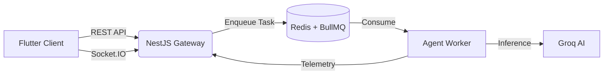

<div align="center">
  <h1>📱 Jack Mobile Agent</h1>
  <p><b>The Next-Generation Autonomous AI Agent for Mobile Devices</b></p>
  
  <a href="https://flutter.dev"></a>
  <a href="https://dart.dev"></a>
  <a href="https://socket.io"></a>
  <a href="LICENSE"></a>
</div>

<br/>

> **Jack Mobile Agent** bridges the gap between complex Large Language Model (LLM) reasoning and native on-device execution, delivering a proactive digital assistant with a visually stunning, real-time interface.

## 📑 Table of Contents
- [About the Project](#-about-the-project)
- [Core Features](#-core-features)
- [System Architecture](#-system-architecture)
- [Security & Privacy](#-security--privacy)
- [Getting Started](#-getting-started)
- [License](#-license)

---

## 📖 About the Project

Unlike traditional chatbots that simply stream text responses, Jack is an **Agentic System**. It parses natural language into actionable execution plans, securely interfacing with native device capabilities to complete tasks on your behalf. 

The centerpiece of the application is the **Liquid Orb UI**—a fluid, mesh-gradient visualizer that provides real-time, WebSocket-driven feedback reflecting the AI's internal cognitive states (Thinking, Planning, Executing, and Success).

---

## ✨ Core Features

| Feature | Description |
| :--- | :--- |
| **Agentic Autonomy** | Structures complex plans, executes native tools, and evaluates success autonomously without human intervention. |
| **Blazing Fast AI** | Deeply integrated with **Groq's LPU** architecture (`llama3-8b-8192`) for near-instantaneous reasoning. |
| **Real-Time Telemetry** | Utilizes **Socket.IO** to synchronize the mobile UI with the backend execution engine instantly. |
| **Premium UX/UI** | Features a dynamic, breathing "Orb" visualizer and sleek, frosted glassmorphism aesthetics. |

---

## 🏗️ System Architecture

The ecosystem is engineered with strict boundaries of responsibility to ensure scalability, low latency, and absolute security.



1. **Presentation Layer (Flutter)**: Handles UI rendering, WebSocket subscriptions, and secure storage.
2. **RESTful Gateway (`jack-api`)**: A NestJS edge server managing JWT authentication and Socket.IO bridging.
3. **Message Broker (Redis + BullMQ)**: Ensures reliable asynchronous task queuing.
4. **Agent Worker (`jack-worker`)**: The background service that processes queues, interfaces with Groq, and evaluates tool logic.
5. **Persistence Layer (PostgreSQL)**: Stores execution history, long-term memory, and tool definitions.

---

## 🔒 Security & Privacy

Enterprise-grade security principles are woven into the core of the application:

- **Zero Client-Side Secrets**: All LLM API keys and infrastructure credentials remain strictly confined to the backend server.
- **Secure Hardware Storage**: Authentication tokens are encrypted and stored in the native device keystore via `flutter_secure_storage`.
- **Strict Tenant Isolation**: JWT-based authentication ensures user data, execution history, and agent memories are cryptographically partitioned.

---

## 🚀 Getting Started

### Prerequisites
- [Flutter SDK](https://flutter.dev/docs/get-started/install) (Latest Stable)
- A running instance of the **Jack Backend Infrastructure**

### Installation

1. **Clone the repository:**
   ```bash
   git clone https://github.com/JACK-AI7/Jack-Mobile-Agent.git
   cd Jack-Mobile-Agent
   ```

2. **Install dependencies:**
   ```bash
   flutter pub get
   ```

3. **Configure the Environment:**
   Update your backend endpoint in `lib/config/environment.dart`. 
   *(Defaults to `http://localhost:3000` for debug builds and your production URL for `--release` builds).*

4. **Run the Application:**
   ```bash
   flutter run
   ```

---

## 📄 License

This project is licensed under the MIT License.

Copyright &copy; 2026 **B JASWANTH REDDY**. All rights reserved.

See the [LICENSE](LICENSE) file for the full legal text.
